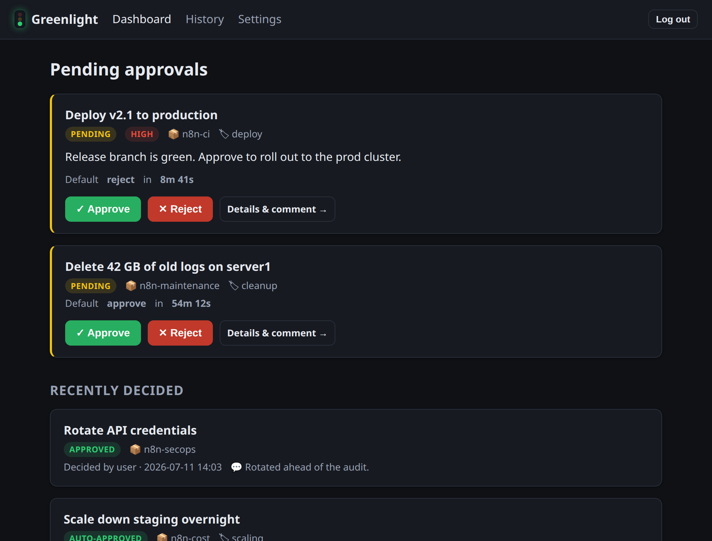
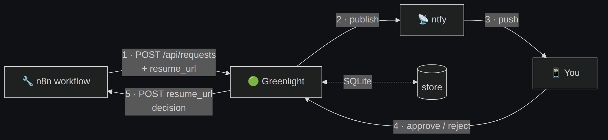

<div align="center">


# Greenlight

**A self-hosted approval broker between your automations and you.**

Your automation asks for permission → you get a push notification → you tap
**Approve** or **Reject** → the automation continues. Don't answer in time and a
configurable default fires automatically.




</div>

---

## How it works



1. An automation hits `POST /api/requests` with its details and its n8n
   **Wait-node resume URL**.
2. Greenlight stores it, then pushes a notification with a deep link.
3. You open the link and **Approve** or **Reject** (optionally with a comment).
4. Greenlight calls the resume URL — the workflow continues down the right branch.
5. No response before the timeout? The **default action** fires and resumes the
   workflow the same way, marked as auto-decided.

→ Full walkthrough with sequence & state diagrams in
**[docs/architecture.md](docs/architecture.md)**.

## Features

- 🟢 **One-tap approvals** from a clean, mobile-friendly web UI (installable as a PWA).
- ⏱️ **Timeout defaults** per source/category — approve or reject automatically if you're away.
- 🔁 **Restart-safe & exactly-once** — deadlines survive restarts; a decision racing a timeout resolves exactly once.
- 📡 **Push via your own [ntfy](https://ntfy.sh)** — or run notification-free and just watch the dashboard.
- 🔒 **Built to expose** — API-key auth, rate-limited login, HMAC sessions, CSRF, hashed keys.
- 📦 **Single self-contained binary** — Go + embedded templates/assets + SQLite. No external services required.

## Quick start

**Local (no Docker):**

```bash
export GREENLIGHT_ADMIN_PASSWORD='pick-a-password'
export GREENLIGHT_SESSION_SECRET="$(openssl rand -hex 32)"
export GREENLIGHT_PUBLIC_URL='http://localhost:8080'

go run ./cmd/greenlight
```

Open <http://localhost:8080> and log in. The first run prints a **bootstrap API
key** to the logs — use it as the `X-API-Key` header for `/api/*`.

**Create a test request:**

```bash
curl -X POST http://localhost:8080/api/requests \
  -H "X-API-Key: <your-key>" -H "Content-Type: application/json" \
  -d '{
        "title": "Deploy v2.1 to prod",
        "source": "manual-test",
        "priority": "high",
        "timeout_seconds": 300,
        "default_action": "reject",
        "resume_url": "https://webhook.site/your-uuid"
      }'
```

It appears on the dashboard; approving/rejecting POSTs the decision to
`resume_url`.

**Docker:** see **[docs/deployment.md](docs/deployment.md)**.

## Documentation

| Guide | |
|---|---|
| 🏗️ **[Architecture](docs/architecture.md)** | Components, flow, lifecycle, timeout engine. |
| ⚙️ **[Configuration](docs/configuration.md)** | Env vars + default-rule resolution. |
| 🔌 **[API reference](docs/api.md)** | Endpoints, payloads, callback shape. |
| 🔧 **[n8n integration](docs/n8n.md)** | Wait-node wiring + importable workflow. |
| 📡 **[Notifications](docs/notifications.md)** | ntfy setup. |
| 🚀 **[Deployment](docs/deployment.md)** | Docker, tunnels, backups. |
| 🔒 **[Security](docs/security.md)** | Auth model & guarantees. |
| 🛠️ **[Development](docs/development.md)** | Build, test, layout. |

## Tech stack

Go (`net/http` + `html/template`) · SQLite (`mattn/go-sqlite3`) · HTMX (vendored,
no build step) · a background goroutine for the timeout engine. Everything ships
in one binary.

<div align="center">
<sub>Built to keep a human in the loop, without keeping a human at their desk.</sub>
</div>
