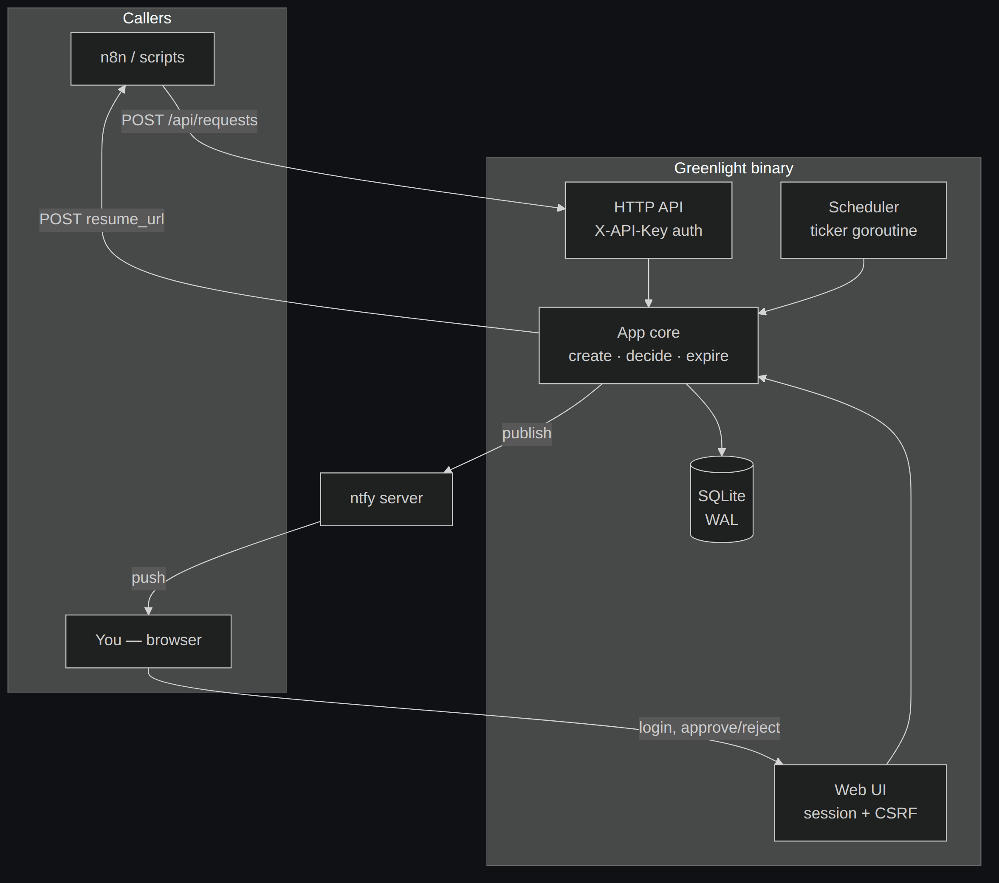
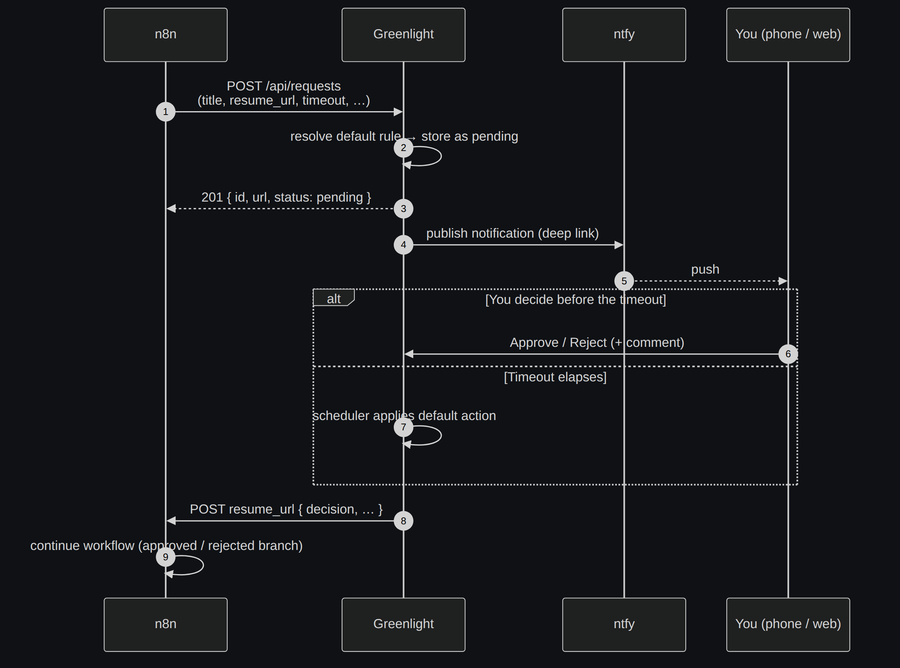
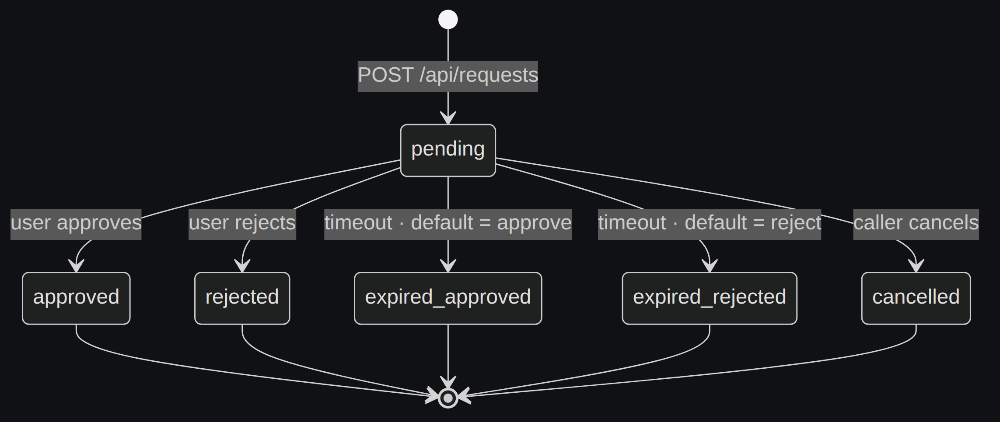
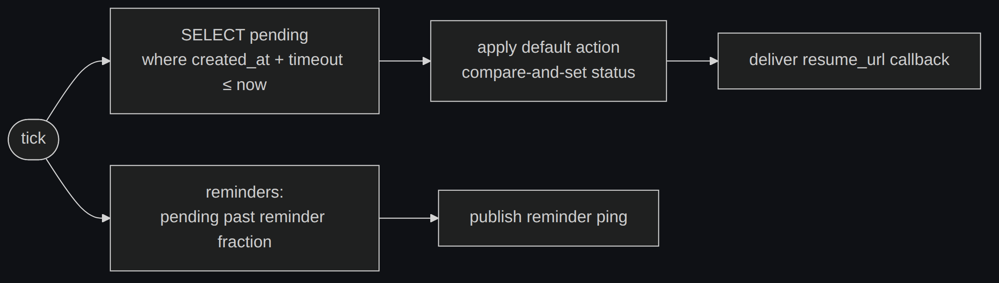

# Architecture

[← Docs index](README.md)

Greenlight is a single Go binary with an embedded web UI and a SQLite database.
It has three moving parts: the **HTTP layer** (JSON API + server-rendered UI), the
**application core** (business logic), and a **background scheduler** that applies
timeout defaults. Everything shares one store.

## Components

- **HTTP API** (`internal/server/api.go`) — authenticated with `X-API-Key`; used by
  n8n and scripts.
- **Web UI** (`internal/server/ui.go`) — single-admin session auth, CSRF-protected
  forms, HTMX for inline approve/reject.
- **App core** (`internal/app`) — the only place that creates, decides, and
  expires requests; also owns ntfy publishing and callback delivery.
- **Scheduler** (`internal/scheduler`) — a `time.Ticker` goroutine that scans for
  overdue and reminder-due requests.
- **Store** (`internal/store`) — SQLite via `mattn/go-sqlite3`, WAL mode, a single
  writer connection.

## The approval flow

n8n only ever holds an open connection at the **Wait node** — Greenlight returns
`201` immediately, so no execution sits blocked on a long poll.

## Request lifecycle

A request is created `pending` and moves exactly once into a terminal state.

| Status | `decided_by` | Meaning |
|---|---|---|
| `pending` | — | Awaiting a decision. |
| `approved` / `rejected` | `user` | You decided in the UI. |
| `expired-approved` / `expired-rejected` | `timeout` | The default action fired. |
| `cancelled` | `api` | The caller withdrew the request. |

## Timeout engine

The scheduler ticks every `GREENLIGHT_SCHEDULER_INTERVAL` (default 15s):

Two properties make this safe:

- **Restart-safe.** Overdue requests are found by a SQL predicate on
  `created_at + timeout_seconds`, not by in-memory timers. A restart re-discovers
  them on the next tick, so no deadline is ever lost.
- **Race-safe (exactly-once).** Expiry and user decisions both go through a
  transactional compare-and-set that only transitions a row **if it is still
  `pending`**. If you approve at the same instant the timeout fires, exactly one
  wins and the other is a no-op. This is covered by a concurrency test in
  `internal/store/store_test.go`.

## Callback delivery

When a request resolves, the decision is POSTed to its `resume_url` in a tracked
background goroutine with exponential backoff (`GREENLIGHT_CALLBACK_MAX_RETRIES`).
Success or final failure is recorded on the row; failures surface in the UI as a
**“callback failed”** badge. On shutdown the process waits for in-flight
deliveries to finish. See the [API callback payload](api.md#callback-payload).

## Package layout

| Package | Responsibility |
|---|---|
| `cmd/greenlight` | main, wiring, graceful shutdown |
| `internal/config` | env-var configuration + validation |
| `internal/models` | domain types, status/action transitions |
| `internal/store` | SQLite persistence (requests, rules, API keys) |
| `internal/app` | business logic (create/decide/expire, ntfy, callbacks) |
| `internal/ntfy` | ntfy publish client |
| `internal/resume` | resume-URL callback delivery with retries |
| `internal/scheduler` | background timeout + reminder engine |
| `internal/server` | HTTP API + web UI (auth, CSRF, templates) |
| `web/` | embedded templates + static assets (HTMX, CSS, icon) |
