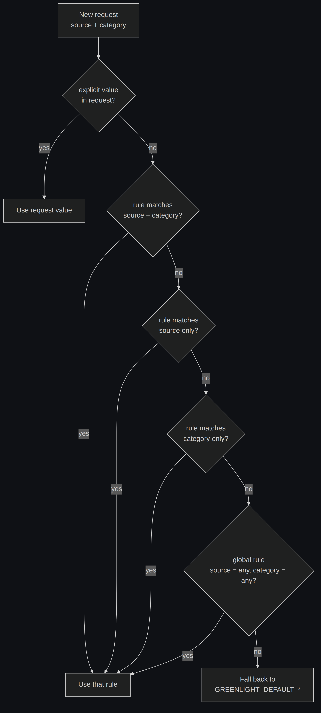

# Configuration

[← Docs index](README.md)

All configuration is via environment variables. In Docker, set them in `.env`
(see [`.env.example`](../.env.example)).

## Environment variables

### Required

| Variable | Notes |
|---|---|
| `GREENLIGHT_ADMIN_PASSWORD` | Web UI login password (single admin user). |
| `GREENLIGHT_SESSION_SECRET` | Signs session/CSRF cookies. Must be ≥16 bytes. Generate with `openssl rand -hex 32`. |

### Server

| Variable | Default | Notes |
|---|---|---|
| `GREENLIGHT_ADDR` | `:8080` | Listen address. |
| `GREENLIGHT_PUBLIC_URL` | `http://localhost:8080` | Externally reachable base URL; used to build notification deep links. |
| `GREENLIGHT_DB_PATH` | `greenlight.db` | SQLite file path (`/data/greenlight.db` in Docker). |
| `GREENLIGHT_SESSION_TTL` | `168h` | Login session lifetime. |
| `TZ` | `UTC` | Timezone for timestamps shown in the UI. |

### Defaults engine

| Variable | Default | Notes |
|---|---|---|
| `GREENLIGHT_DEFAULT_ACTION` | `reject` | Global fallback action applied on timeout. |
| `GREENLIGHT_DEFAULT_TIMEOUT_SECONDS` | `3600` | Global fallback timeout. |
| `GREENLIGHT_HISTORY_RETENTION` | *(off)* | Auto-delete decided requests older than this ([Go duration](https://pkg.go.dev/time#ParseDuration), e.g. `168h` = 7 days). Pending requests are never deleted. Unset = keep forever. |
| `GREENLIGHT_SCHEDULER_INTERVAL` | `15s` | How often overdue requests are scanned. |
| `GREENLIGHT_REMINDER_ENABLED` | `true` | Re-notify while a request is still pending. |
| `GREENLIGHT_REMINDER_FRACTION` | `0.5` | Send a reminder after this fraction of the timeout elapses (0–1, exclusive). |
| `GREENLIGHT_NOTIFY_ON_TIMEOUT` | `true` | Publish a notification when a default action auto-fires. |

### Notifications (ntfy)

| Variable | Default | Notes |
|---|---|---|
| `GREENLIGHT_NTFY_BASE_URL` | — | e.g. `https://ntfy.example.com`. Empty disables notifications. |
| `GREENLIGHT_NTFY_TOPIC` | — | Topic to publish to. |
| `GREENLIGHT_NTFY_TOKEN` | — | Bearer token. |
| `GREENLIGHT_NTFY_USER` | — | Basic-auth user (alternative to token). |
| `GREENLIGHT_NTFY_PASS` | — | Basic-auth password. |

See [Notifications](notifications.md) for the full ntfy walkthrough.

### Callbacks

| Variable | Default | Notes |
|---|---|---|
| `GREENLIGHT_RESUME_METHOD` | `POST` | HTTP method for the resume call. **Must match the n8n Wait node's webhook method** (`GET`/`POST`/`PUT`/`PATCH`) or n8n returns 404. See [n8n integration](n8n.md#matching-the-http-method). |
| `GREENLIGHT_CALLBACK_MAX_RETRIES` | `4` | Resume-URL retry attempts (exponential backoff). |
| `GREENLIGHT_CALLBACK_TIMEOUT` | `15s` | Per-attempt HTTP timeout. |

The decision is **always** appended to the resume URL as query parameters as
well, so it's readable regardless of method (a GET Wait node reads it from
`$json.query`, a POST node from `$json.body`).

## Default rules

When a request omits `default_action` and/or `timeout_seconds`, Greenlight fills
them in from a **default rule**, matched by `source` + `category`. Rules are
managed on the **Settings** page. The most specific match wins:

`default_action` and `timeout_seconds` are resolved **independently** — a request
can take its action from a rule and its timeout from the config fallback, or vice
versa.

**Example.** With these rules:

| Source | Category | Action | Timeout |
|---|---|---|---|
| `backups` | `cleanup` | approve | 300 |
| `backups` | *(any)* | approve | 600 |
| *(any)* | *(any)* | reject | 3600 |

- A `backups` / `cleanup` request → **approve, 300s** (exact match).
- A `backups` / `restore` request → **approve, 600s** (source-only match).
- A `deploys` / anything request → **reject, 3600s** (global rule).
