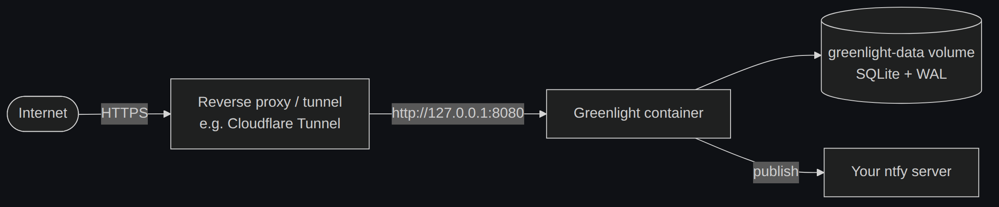

# Deployment

[← Docs index](README.md)

Greenlight is one small binary + a SQLite file. The recommended setup is Docker
behind your own reverse proxy or tunnel for HTTPS.



## With Docker Compose

The bundled [`docker-compose.yml`](../docker-compose.yml) runs **only** Greenlight
(notifications go to your existing ntfy server). It binds to `127.0.0.1:8080`, so
nothing is directly exposed — put a proxy/tunnel in front.

```bash
cp .env.example .env      # fill in passwords, ntfy server/topic/token, public URL
docker compose up -d --build
```

Set `GREENLIGHT_PUBLIC_URL` to the public hostname your proxy maps to the
container. For a purely local test, just hit `http://localhost:8080`.

## Putting it on the internet

Greenlight doesn't terminate TLS itself. Front it with whatever you already run:

- **Cloudflare Tunnel** — point a public hostname at `http://<host>:8080`.
- **nginx / Caddy / Traefik** — reverse-proxy to `127.0.0.1:8080`.

Whatever you choose, make sure `GREENLIGHT_PUBLIC_URL` is `https://…` so session
and CSRF cookies are marked `Secure` automatically.

## First run

On first start with an empty database, Greenlight mints a **bootstrap API key**
and logs it once:

```json
{"level":"WARN","msg":"no API keys found — generated a bootstrap key …","api_key":"glk_…"}
```

Copy it for n8n, then manage more keys under **Settings → API keys**.

## Building the image yourself

The `Dockerfile` is a multi-stage build. Because `mattn/go-sqlite3` uses cgo, the
builder stage needs a C toolchain (`build-base` on Alpine) and `CGO_ENABLED=1`;
the runtime stage is a slim Alpine image with `ca-certificates` and `tzdata`.

```bash
docker build -t greenlight .
```

## Data & backups

Everything lives in the SQLite database at `GREENLIGHT_DB_PATH`
(`/data/greenlight.db` in the container, on the `greenlight-data` volume). WAL mode
creates `-wal` / `-shm` sidecar files.

To back up, stop the container (or use the SQLite backup API) and copy the `.db`
file:

```bash
docker compose stop greenlight
docker run --rm -v greenlight_greenlight-data:/data -v "$PWD":/backup alpine \
  cp /data/greenlight.db /backup/greenlight-backup.db
docker compose start greenlight
```

## Health check

`GET /healthz` returns `200 {"status":"ok"}` when the process and database are
reachable (the container's `HEALTHCHECK` uses it). It requires no auth, so it's
safe for a load balancer or uptime monitor.
