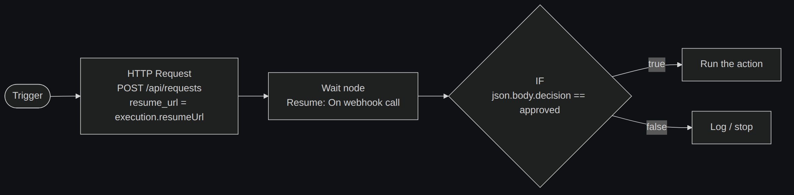

# n8n integration

[← Docs index](README.md)

Greenlight is driven entirely by n8n's **Wait node** callback — no polling, no
open long-poll connections. A ready-to-import workflow is in
[`n8n-workflow.json`](n8n-workflow.json).

## The pattern

1. **HTTP Request node** → `POST /api/requests`:
   - Header `X-API-Key: {{ $env.GREENLIGHT_API_KEY }}`.
   - Body includes `"resume_url": "{{ $execution.resumeUrl }}"` plus your title,
     description, timeout, etc. See the [API reference](api.md#post-apirequests).
2. **Wait node** → *Resume: On webhook call*. Set its **HTTP Method** to match
   `GREENLIGHT_RESUME_METHOD` (see below), and its safety timeout a little
   **longer** than the request's `timeout_seconds`, so Greenlight's default action
   fires first in the normal case.
3. **IF node** on `{{ $json.body.decision }}`:
   - `approved` → run the automation.
   - `rejected` → log and stop.

## Matching the HTTP method

⚠️ **This is the most common integration bug.** The n8n Wait node registers its
resume webhook for **one specific HTTP method**. If Greenlight calls it with a
different method, n8n returns **404** and your workflow never resumes (even though
the resume URL works when you `curl` it — a bare `curl` sends `GET`).

- n8n's Wait node **defaults to `GET`**.
- Greenlight **defaults to `POST`** (`GREENLIGHT_RESUME_METHOD`), which is what the
  bundled reference workflow's Wait node is set to.

So either:

| Your Wait node method | Set `GREENLIGHT_RESUME_METHOD` | Read the decision from |
|---|---|---|
| `POST` (reference workflow) | `POST` (default) | `{{ $json.body.decision }}` |
| `GET` (n8n default) | `GET` | `{{ $json.query.decision }}` |

Greenlight **always** appends the decision fields (`decision`, `status`,
`decided_by`, `id`, comment, and any `resume_payload_extra`) to the resume URL as
**query parameters** too — so `{{ $json.query.decision }}` works no matter which
method you pick, and only `POST`/`PUT`/`PATCH` additionally get the JSON body.

> **Older n8n builds** may expose POST data at `$json.decision` instead of
> `$json.body.decision`. If your IF node never matches, log the resumed item to
> see where the fields landed.

## Importing the reference workflow

1. In n8n: **Workflows → Import from File** → pick
   [`docs/n8n-workflow.json`](n8n-workflow.json).
2. Set a `GREENLIGHT_API_KEY` environment variable (or hard-code the key in the
   HTTP Request node's header).
3. Point the `url` in the **Request approval** node at your Greenlight host.
4. Adjust the JSON body (title, source, category, timeout) for your use case.

## Tips

- **Match the timeouts.** Keep the Wait node's own timeout slightly above
  `timeout_seconds` so the Greenlight default is what resumes the flow — not n8n's
  fallback.
- **Pass context through.** Anything you put in `resume_payload_extra` comes back
  in the callback, so you can thread correlation IDs or branch hints through the
  approval without re-fetching state.
- **Cancel when moot.** If a later step makes the approval irrelevant, call
  [`POST /api/requests/{id}/cancel`](api.md#other-endpoints) so it disappears from
  your dashboard.
