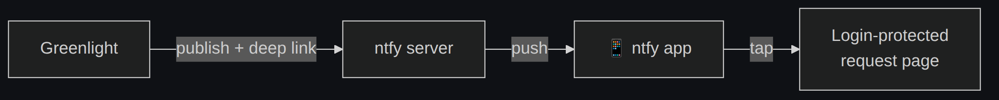

# Notifications (ntfy)

[← Docs index](README.md)

Greenlight pushes notifications through your own [ntfy](https://ntfy.sh) server.
Notifications are **optional** — leave `GREENLIGHT_NTFY_BASE_URL` blank and
requests still work; you just watch the dashboard instead.



## Setup

Point Greenlight at your server:

```bash
GREENLIGHT_NTFY_BASE_URL=https://ntfy.yourdomain.com
GREENLIGHT_NTFY_TOPIC=greenlight-approvals
GREENLIGHT_NTFY_TOKEN=<token with write access to the topic>
```

Then:

1. Install the ntfy app on your phone and **subscribe** to the topic.
2. If your server locks topics down (recommended, so they aren't world-readable),
   create a token with write access and set `GREENLIGHT_NTFY_TOKEN`. For a server
   using basic auth instead, set `GREENLIGHT_NTFY_USER` / `GREENLIGHT_NTFY_PASS`.
3. Go to **Settings → Send test notification** to verify the wiring end-to-end.

## What gets published

| Event | When | Priority |
|---|---|---|
| **Approval needed** | A request is created | mirrors the request's `priority` |
| **Reminder** | Still pending after `REMINDER_FRACTION` of the timeout | request priority |
| **Auto-decided** | A timeout default fires (if `NOTIFY_ON_TIMEOUT`) | low |

Each notification's tap target (`Click` header) is the request's detail page.

## Security

Notification deep links point at the **login-protected** detail page. Greenlight
never puts an auth token or an approve/reject action link in a notification, so a
leaked or cached push **cannot** approve anything on its own — a human still has to
log in and decide. See [Security](security.md).

## Priority mapping

| Greenlight `priority` | ntfy priority |
|---|---|
| `low` | 2 |
| `normal` | 3 |
| `high` | 5 |
